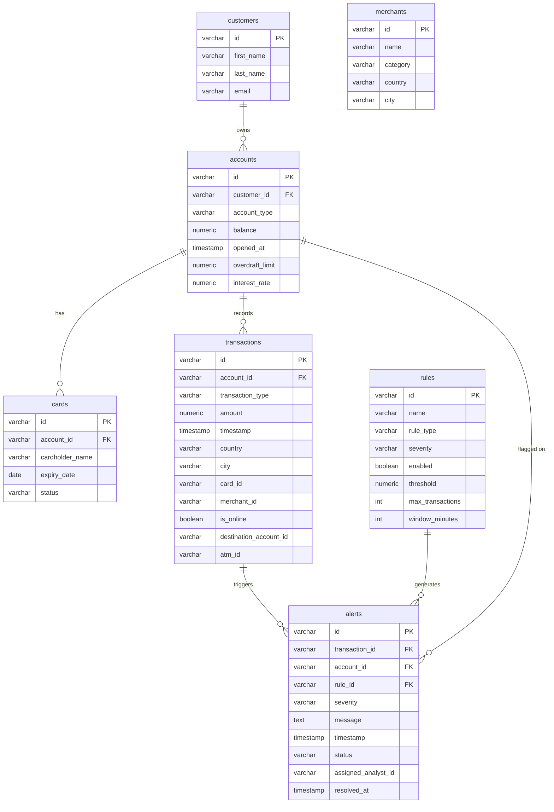

# Fraud Detection System

Project for **Advanced Object-Oriented Programming (PAOJ) - 2026**.

A Java application that simulates a bank transaction fraud detection system - records
transactions, applies configurable detection rules, generates alerts, and tracks risk
scores per account. Everything is persisted in PostgreSQL.

I picked this topic because I want to move toward machine learning and anomaly detection
later on - fraud detection is one of the most common industrial applications of those
fields. The rule engine is built so a future ML-based rule could just plug in as another
`Rule` subclass without changing anything else.

---

## Tech stack

| Component | Details |
|---|---|
| Java | 25 |
| Build | Plain IntelliJ project (no Maven/Gradle) |
| Database | PostgreSQL 18 |
| DB access | Pure JDBC, no ORM |
| Audit | CSV append-only |

---

## Requirements

- JDK 21+
- PostgreSQL running locally
- PostgreSQL JDBC driver (`postgresql-42.7.11.jar`) added as a project library

---

## How to run

1. Install PostgreSQL and create a database named `fraud_detection`
2. Run the contents of `schema.sql` against it (creates the 7 tables)
3. In `src/repository/DatabaseConnection.java`, update credentials if yours differ:
   ```java
   private static final String URL = "jdbc:postgresql://localhost:5432/fraud_detection";
   private static final String USER = "postgres";
   private static final String PASSWORD = "admin";
   ```
4. Add `postgresql-42.7.11.jar` to your project (File → Project Structure → Libraries → +)
5. Run `Main.java`

On every run, `Main` wipes the tables and reseeds the demo scenario from scratch
so the output is reproducible. Obviously you wouldn't do this in a real app - it's
purely for demo purposes.

---

## Project structure

```
fraud-detection-aop/
├── schema.sql
└── src/
    ├── Main.java                 # entry point, runs the full demo end-to-end
    ├── model/
    │   ├── Customer.java
    │   ├── Account.java          # abstract base
    │   ├── CheckingAccount.java
    │   ├── SavingsAccount.java
    │   ├── Card.java
    │   ├── CardStatus.java
    │   ├── Merchant.java
    │   ├── MerchantCategory.java
    │   ├── Location.java         # value object
    │   ├── Transaction.java      # abstract base
    │   ├── CardTransaction.java
    │   ├── TransferTransaction.java
    │   ├── WithdrawalTransaction.java
    │   ├── Rule.java             # abstract base
    │   ├── AmountRule.java
    │   ├── FrequencyRule.java
    │   ├── LocationRule.java
    │   ├── Alert.java            # implements Comparable<Alert>
    │   ├── AlertStatus.java
    │   ├── Severity.java
    │   ├── RiskScore.java
    │   ├── RiskLevel.java
    │   └── Analyst.java
    ├── service/
    │   ├── CustomerService.java
    │   ├── AccountService.java
    │   ├── CardService.java
    │   ├── MerchantService.java
    │   ├── TransactionService.java     # records tx + auto-runs fraud detection
    │   ├── FraudDetectionService.java  # evaluates rules polymorphically
    │   ├── AlertService.java           # TreeSet<Alert>, sorted by severity
    │   ├── RiskScoreService.java
    │   ├── AnalystService.java
    │   └── AuditService.java           # singleton, writes audit.csv
    ├── repository/
    │   ├── DatabaseConnection.java     # singleton JDBC connection
    │   ├── GenericDao.java             # abstract generic <T>
    │   ├── CustomerDao.java
    │   ├── TransactionDao.java
    │   ├── RuleDao.java
    │   └── AlertDao.java
    ├── util/
    │   └── IdGenerator.java            # AtomicLong-based ID counters
    └── exception/
        ├── EntityNotFoundException.java
        └── InsufficientFundsException.java
```

3 inheritance hierarchies in the model: `Transaction` (3 subtypes), `Account` (2 subtypes),
`Rule` (3 subtypes).

---

## What the demo runs

`Main` plays out a full scenario end-to-end:

1. Wipes the DB clean
2. Persists 3 detection rules
3. Creates a customer (Alice) and an analyst (Maria)
4. Opens a checking account with a 20.000 RON balance
5. Issues a card
6. Registers 2 merchants - one in Bucharest, one in Bangkok
7. Records 7 transactions - some normal, some deliberately suspicious
8. Fraud detection runs automatically after each transaction
9. Persists all generated alerts in the DB
10. Reads everything back from the DB and prints it
11. Computes Alice's risk score (ends up HIGH)
12. The analyst processes every alert - confirms CRITICAL/HIGH as fraud, marks the rest as false positive
13. Recomputes the risk score (drops to LOW once everything's resolved)
14. Disables one rule (UPDATE demo)
15. Creates and deletes a second customer (DELETE demo)

### What triggers each rule

| Rule | Threshold | What sets it off |
|---|---|---|
| `AmountRule` | over 5000 RON | the 8500 RON transaction |
| `FrequencyRule` | more than 3 transactions in 5 minutes | a burst of 4 small ones |
| `LocationRule` | different country within 60 minutes | the Bangkok transaction right after activity in Bucharest |

### Sample output

```
Customers:
Alice Popescu (CUST-1000)
Rules:
Large transaction [HIGH, enabled=true]
Burst transactions [MEDIUM, enabled=true]
Impossible travel [CRITICAL, enabled=true]
Transactions:
CARD TX-1 amount=250.00 at Bucuresti, Romania on 2026-05-25T18:08:40.659739
CARD TX-2 amount=8500.00 at Bucuresti, Romania on 2026-05-25T18:08:40.668744
...
Alerts:
[CRITICAL] Transaction from different country within 60 minutes (alert=ALRT-5, status=OPEN)
[HIGH] Amount exceeds 5000 (alert=ALRT-1, status=OPEN)
[MEDIUM] More than 3 transactions in 5 minutes (alert=ALRT-6, status=OPEN)
...
Risk score for Alice: RiskScore[account=ACC-2000, score=100, level=HIGH]
Analyst review:
Confirmed fraud: [CRITICAL] Transaction from different country within 60 minutes (...)
Confirmed fraud: [HIGH] Amount exceeds 5000 (...)
Analyst: Maria Vasilescu (ANL-1), resolved=6
Risk score after review: RiskScore[account=ACC-2000, score=0, level=LOW]
```

---

## Database schema



Both `Transaction` and `Rule` use **single-table inheritance** in the DB - all subtypes
in one table, with a discriminator column (`transaction_type` / `rule_type`) telling
you which subclass each row represents. Type-specific columns are NULL for the rows
that don't use them.

`account_id` is intentionally **denormalized** on the `alerts` table. You could derive
it through `transaction_id`, but having it directly avoids N+1 queries when you want
all alerts for a given account.

---

## Notable design choices

- **`BigDecimal` for money**, not `double`. Floating-point math has precision errors
  that compound badly with financial data.
- **`PreparedStatement` everywhere** - no string concatenation in any SQL, so no SQL
  injection surface.
- **`try-with-resources`** on every `Statement`/`ResultSet`, so they get closed even if
  something throws halfway through.
- **Two constructors on `Transaction` and `Alert`** - one for creating fresh objects
  (sets `timestamp = now()`), one for rehydrating from the DB (takes the timestamp as
  a parameter). Pretty much how any ORM handles it under the hood.
- **`TreeSet<Alert>` + `Comparable<Alert>`** for natural severity-ordered iteration.
  Tie-breaker on ID so two distinct alerts with the same severity and timestamp don't
  collapse into one.
- **Strategy pattern via `Rule`** - each rule subclass implements `matches()` its own
  way, and `FraudDetectionService` evaluates them polymorphically. Adding a new rule
  type doesn't require touching the service.

---

## Audit

Every significant action is appended to `audit.csv` in the working directory:

```
action_name,timestamp
CLEAR_TABLES,2026-05-25T18:08:40.5234229
CREATE_RULE,2026-05-25T18:08:40.5854237
CREATE_CUSTOMER,2026-05-25T18:08:40.6044213
OPEN_ACCOUNT,2026-05-25T18:08:40.6204321
RECORD_TRANSACTION,2026-05-25T18:08:40.6459501
CREATE_ALERT,2026-05-25T18:08:40.6969486
CONFIRM_FRAUD,2026-05-25T18:08:40.7814763
MARK_FALSE_POSITIVE,2026-05-25T18:08:40.7934789
DISABLE_RULE,2026-05-25T18:08:40.8204869
DELETE_CUSTOMER,2026-05-25T18:08:40.8339995
```

In a real system this would live in a dedicated audit table or get shipped off to
something like Splunk, but for a project this size CSV is fine.